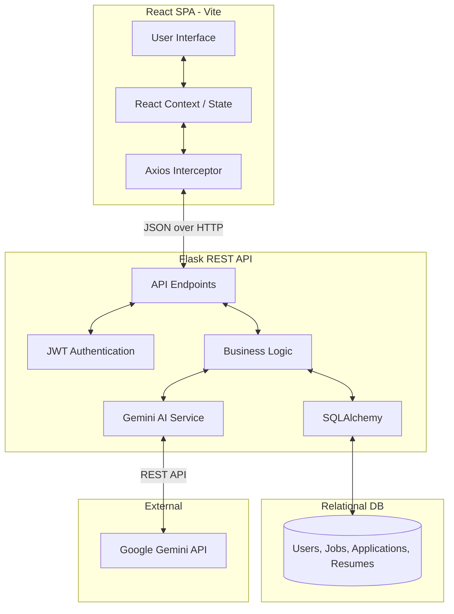
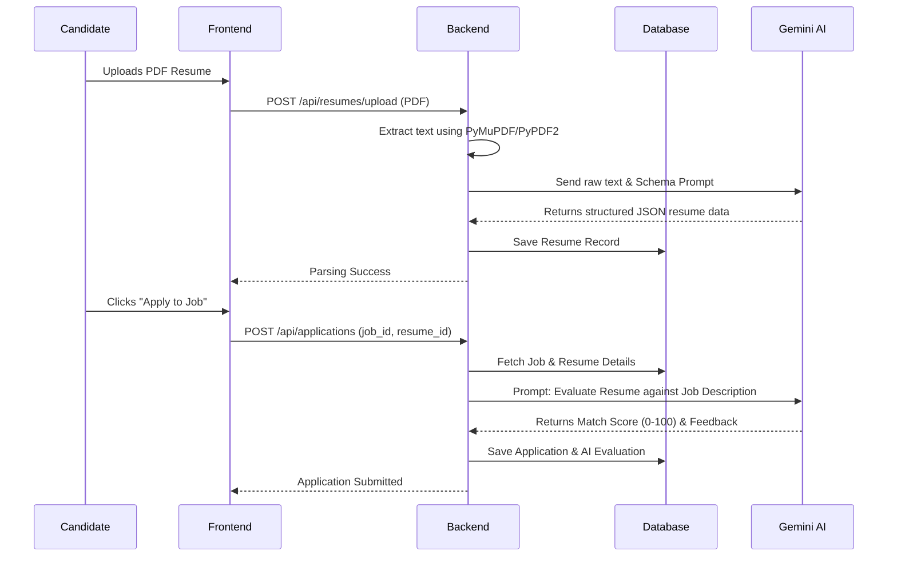

# High-Level Design (HLD)

## 1. System Architecture
ShortlistIQ follows a modern decoupled Client-Server architecture. The presentation layer is built as a React Single Page Application (SPA), which communicates with a Python/Flask RESTful API backend. Data persistence is handled via a relational database (SQLite/PostgreSQL) managed by SQLAlchemy ORM.

## 2. Core Components

### 2.1 Frontend Layer
- **Framework**: React 18 powered by Vite for rapid HMR and optimized bundling.
- **Styling**: TailwindCSS for utility-first, responsive, and highly customizable UI design.
- **Animations**: Framer Motion for premium micro-interactions, modal transitions, and route animations.
- **Routing**: `react-router-dom` for client-side routing, protected routes, and role-based access control.

### 2.2 Backend Layer
- **Framework**: Flask (Python) providing a lightweight, modular REST API.
- **Authentication**: `PyJWT` for generating and verifying JSON Web Tokens. Passwords hashed via `werkzeug.security`.
- **Database ORM**: `Flask-SQLAlchemy` for object-relational mapping, ensuring protection against SQL injection and simplifying data manipulation.
- **CORS**: `Flask-CORS` configured to allow secure cross-origin requests from the React frontend.

### 2.3 AI Integration (The "Brain")
The system leverages **Google's Gemini LLM** (via `google.generativeai`) for two critical functions:
1. **Resume Parsing**: Taking raw extracted text from a PDF and returning a structured JSON schema containing skills, experience timeline, and education.
2. **Contextual Evaluation**: Comparing a candidate's parsed resume against a job description. The prompt engineering forces the LLM to return a deterministic JSON object containing a strict numerical `match_score` (0-100) and an array of `rationale` points (both matching and missing criteria).

## 3. Data Flow: Job Application & Evaluation

## 4. Entity Relationship Model
- **User**: Base model for authentication. Subdivided by `role` ('admin', 'recruiter', 'candidate').
- **Resume**: Belongs to a Candidate (User). Stores parsed JSON data and file path.
- **Job**: Created by a Recruiter (User). Contains title, description, skills required, and status.
- **Application**: The associative entity linking a Candidate (User), Job, and Resume. Stores the AI match score, evaluation rationale, and current pipeline status ('applied', 'shortlisted', 'rejected', 'hired').
